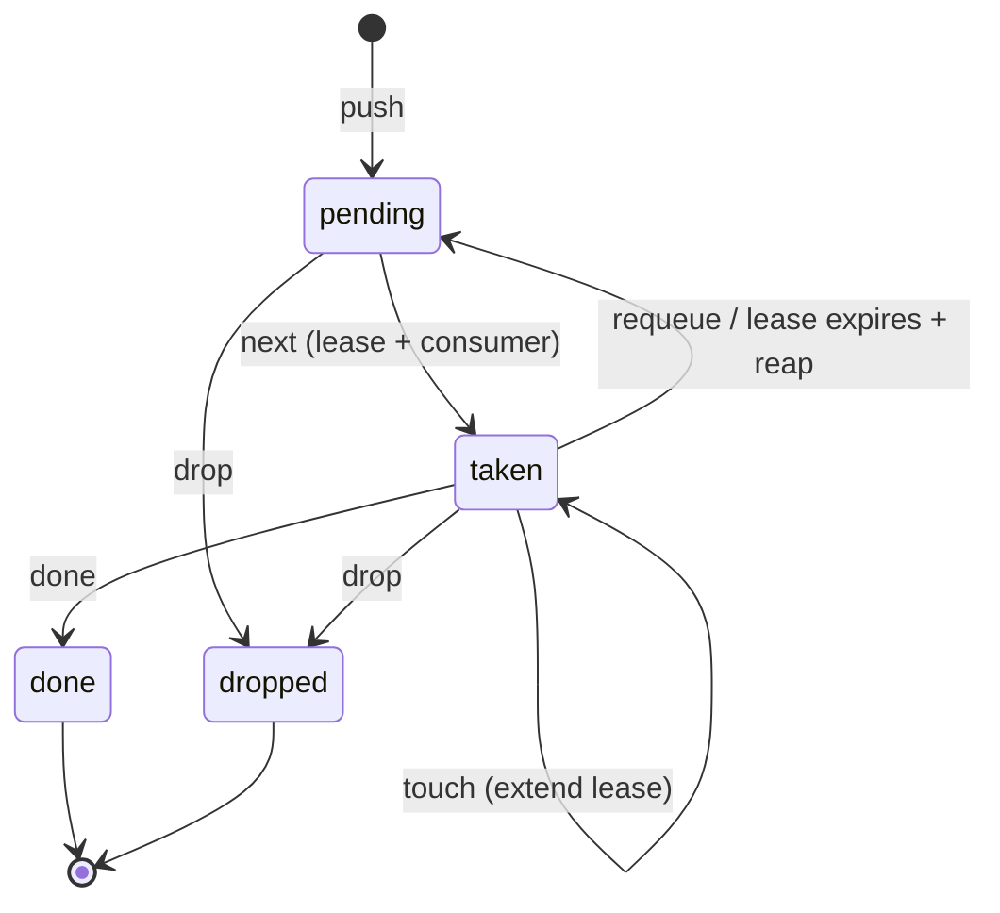

# laneq

[](https://github.com/selamy-labs/laneq/actions/workflows/test.yml)
[](./LICENSE)

`laneq` is a tiny local SQLite priority queue for feeding directives to
autonomous agents and orchestrators. It never talks to the network and stores
only the queue data you put into its local database.

Part of Patrick Selamy's public agent-systems work:
[selamy.dev](https://selamy.dev) ·
[GitHub profile](https://github.com/pselamy) ·
[agent-skills](https://github.com/selamy-labs/agent-skills)

Priorities sort as `P0 < P1 < P2`, with FIFO ordering inside each priority.
`next` atomically takes one pending item so concurrent workers do not receive
the same directive.

## Install

Run directly from GitHub:

```bash
uvx --from git+https://github.com/selamy-labs/laneq@v0.4.0 laneq --help
```

Or install with pipx:

```bash
pipx install git+https://github.com/selamy-labs/laneq@v0.4.0
```

The `laneq` name is already occupied on PyPI by an unrelated lane-line
detection package, so releases are GitHub-tag based until the distribution
name is resolved.

## Directive lifecycle

Each directive moves through a small state machine. `next` takes the
highest-priority pending directive and gives it a lease; the worker either
finishes it (`done`), hands it back (`requeue`), or lets the lease expire — in
which case `reap` (or the next queue operation) returns it to `pending` and
increments its `requeue_count`.



`peek` reads the next pending directive without changing its state. Priorities
sort `P0 < P1 < P2`, FIFO within a priority; lanes and parent threads partition
work without changing this lifecycle.

## Usage

```bash
laneq push -p P0 -b "ship the smallest verified fix"
laneq peek
laneq next --id --consumer worker-a
laneq done 1
laneq stats
```

Read a directive body from a file:

```bash
laneq push -p P1 -f directive.txt
```

Use a specific database path:

```bash
LANEQ_DB=/tmp/laneq.db laneq list --all
```

The default database is `~/.claude/laneq.db`.

## Coordination

Consumers can identify themselves when taking work:

```bash
laneq next --id --consumer worker-a
laneq list --all
laneq stats
```

Taken directives receive a lease. The default lease is 30 minutes, configurable
with `LANEQ_LEASE_SECONDS`. Use `--lease` on `next`
or `touch` to set or extend it:

```bash
laneq next --consumer claude --lease 45m
laneq touch 7 --lease 10m
laneq reap --expired-leases
```

Expired leases are reclaimed lazily on queue operations and increment the
directive's `requeue_count`.

Use lanes to isolate independent work streams inside the same SQLite database:

```bash
laneq push --lane release -p P0 -b "verify release candidate"
laneq next --lane release --consumer worker-a
laneq list --lane release
```

Use parent links to create directive threads:

```bash
laneq push -p P0 -b "investigate incident"
laneq push --parent 1 -p P0 -b "collect deployment evidence"
laneq list --thread 1
laneq thread-status 1
```

## Commands

- `push`: enqueue a directive from `--body`, `--file`, or stdin; add `--lane`
  and `--parent` to route and thread it.
- `next`: atomically take the highest-priority pending directive and print its
  body; add `--consumer`, `--lease`, and `--lane` for multi-worker coordination.
- `peek`: print the next pending directive without taking it; add `--lane` to
  inspect a specific lane.
- `show`: print any directive by id, including lane, thread, consumer, lease,
  and requeue details.
- `list`: list pending directives; add `--all` to include non-pending items,
  `--lane` to filter a lane, or `--thread` to render a thread.
- `reprioritize`: change a directive priority.
- `done`, `requeue`, `drop`: update directive status.
- `touch`: extend the lease for a taken directive.
- `thread-status`: summarize whether a directive thread still has open work.
- `reap`: requeue stale taken directives or expired leases.
- `stats`: print counts by priority/status and taken counts by consumer.

`next` and `peek` exit with status code `3` when the queue is empty.

Existing v0.1 databases migrate in place on first open. New columns are added
for consumers, leases, lane names, parent links, and requeue counts while
preserving existing directive ids and statuses.

Before any migration touches an existing database, `laneq` checkpoints WAL,
copies `laneq.db` to `laneq.db.backup-<UTC>`, opens that backup, and requires
`PRAGMA integrity_check` to return `ok`. The migration then runs in one
transaction; on failure, SQLite rolls the original database back and the
verified backup remains. Backup retention defaults to the last 5 copies and can
be changed with `LANEQ_BACKUP_RETENTION` or `laneq migrate --keep-backups N`.

Use `laneq migrate --dry-run` to inspect planned schema/data changes without
modifying the database. A successful explicit migration prints the changed
steps and backup path.

`codex-q` remains as a compatibility command alias for existing local
automation. Prefer `laneq` for new docs, scripts, and integrations.

## MCP server

`laneq` ships an optional [Model Context Protocol](https://modelcontextprotocol.io)
server so agents can drive the queue as typed tools instead of shelling out to
the CLI. The core package stays dependency-free; the server is an extra:

```bash
pipx install "git+https://github.com/selamy-labs/laneq@v0.4.0#egg=laneq[mcp]"
laneq-mcp   # serves over stdio
```

Or run it directly with `uvx`:

```bash
uvx --from "git+https://github.com/selamy-labs/laneq@v0.4.0" --with mcp laneq-mcp
```

Register it with an MCP client (the server reads the same `LANEQ_DB`, so it
shares one queue with the CLI):

```json
{
  "mcpServers": {
    "laneq": {
      "command": "laneq-mcp",
      "env": { "LANEQ_DB": "/home/you/.claude/laneq.db" }
    }
  }
}
```

The server exposes one tool per queue operation, each with structured JSON
input and output:

- `laneq_push`, `laneq_next`, `laneq_peek`, `laneq_show`, `laneq_list`
- `laneq_reprioritize`, `laneq_done`, `laneq_requeue`, `laneq_drop`
- `laneq_touch`, `laneq_reap`, `laneq_stats`, `laneq_thread_status`

`laneq_next` and `laneq_peek` return `{"empty": true}` when a lane has no
pending work. Every tool wraps the same queue logic the CLI uses, so the two
interfaces never diverge.

### Observability (OpenTelemetry)

The server runs unmodified under
[OpenTelemetry zero-code auto-instrumentation](https://opentelemetry.io/docs/zero-code/python/).
Install the `otel` extra and launch via `opentelemetry-instrument`:

```bash
pipx install "git+https://github.com/selamy-labs/laneq@v0.4.0#egg=laneq[mcp,otel]"
OTEL_SERVICE_NAME=laneq-mcp \
OTEL_EXPORTER_OTLP_ENDPOINT=http://otel-collector:4317 \
OTEL_TRACES_EXPORTER=otlp \
  opentelemetry-instrument laneq-mcp
```

Config is **vendor-neutral** — point `OTEL_EXPORTER_OTLP_ENDPOINT` at any
OTLP collector; the collector (not this server) owns any Cloud Trace / vendor
coupling.

> **stdio safety (required):** this server speaks MCP over stdin/stdout, so its
> stdout carries the JSON-RPC protocol. Export traces/logs via **OTLP only** —
> **never** set `OTEL_TRACES_EXPORTER=console` (or any stdout exporter), which
> would interleave span output into the protocol stream and break the client.

## Development

```bash
python -m pip install -e ".[test]"
coverage run -m pytest
coverage report --fail-under=95
```

The runtime package intentionally has zero third-party dependencies.
