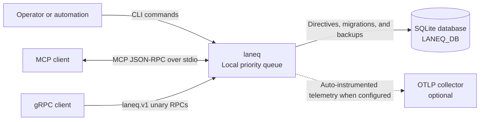

# System context

`laneq` is a local priority queue with a shared SQLite-backed core and three
runtime interfaces. The MCP, gRPC, authentication, and telemetry dependencies
are optional extras; the core package and CLI have no third-party runtime
dependencies.

All three interfaces call the queue operations in `laneq.core`. The CLI and
MCP server select the same local database through `LANEQ_DB` (or the legacy
`CODEX_Q_DB` fallback). The gRPC server maps the protobuf service to those same
operations and can optionally enforce PASETO grants plus per-request proofs;
authentication is off by default.

This view documents runtime clients, persistence, and optional telemetry. The
repository does not define a deployment topology.
