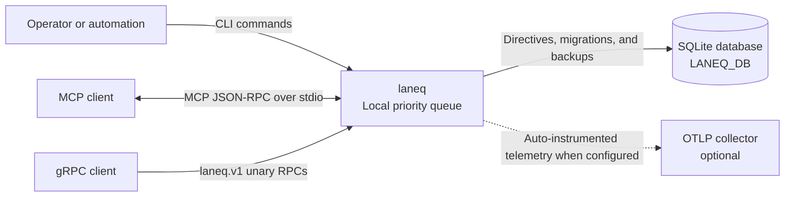
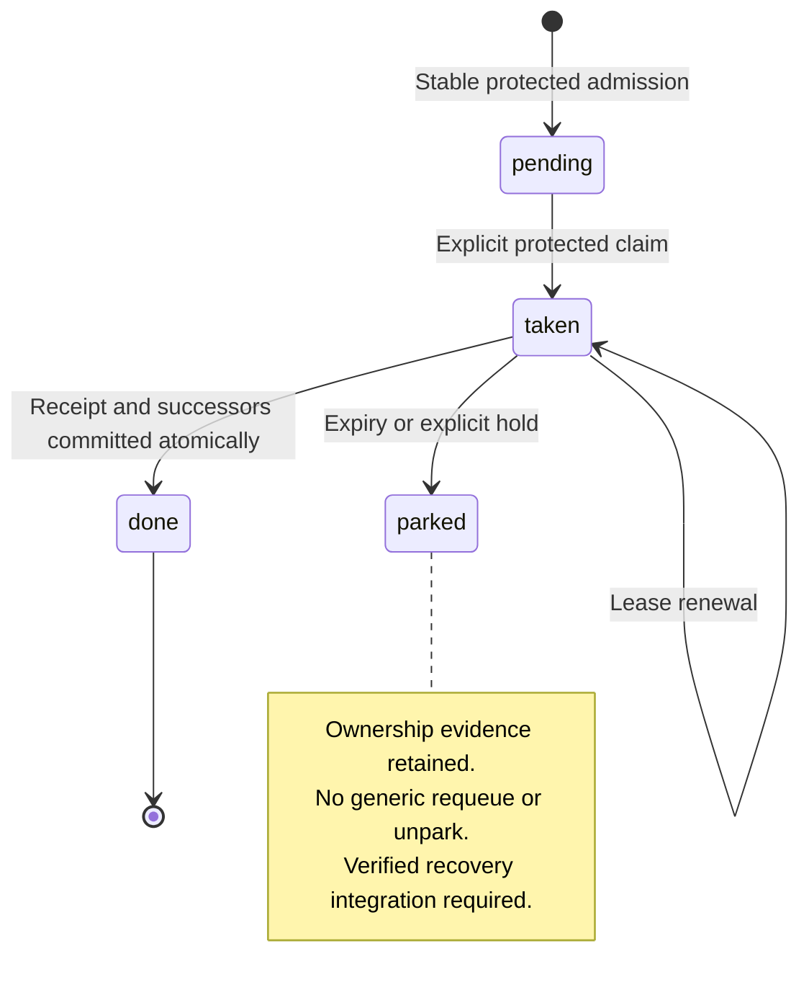

# System context

`laneq` is a local priority queue with a shared SQLite-backed core and three
runtime interfaces. The MCP, gRPC, authentication, and telemetry dependencies
are optional extras; the core package and CLI have no third-party runtime
dependencies.

```mermaid
flowchart LR
    operator["Operator or automation"]
    mcp_client["MCP client"]
    grpc_client["gRPC client"]
    laneq["laneq<br/>Local priority queue"]
    sqlite[("SQLite database<br/>LANEQ_DB")]
    otlp["OTLP collector<br/>optional"]

    operator -->|"CLI commands"| laneq
    mcp_client <-->|"MCP JSON-RPC over stdio"| laneq
    grpc_client -->|"laneq.v1 unary RPCs"| laneq
    laneq -->|"Directives, migrations, and backups"| sqlite
    laneq -.->|"Auto-instrumented telemetry when configured"| otlp
```

All three interfaces call the queue operations in `laneq.core`. The CLI and
MCP server select the same local database through `LANEQ_DB` (or the legacy
`CODEX_Q_DB` fallback). The gRPC server maps the protobuf service to those same
operations and can optionally enforce PASETO grants plus per-request proofs;
authentication is off by default.

This view documents runtime clients, persistence, and optional telemetry. The
repository does not define a deployment topology.

## Protected stage directives

Trusted qualifiers can idempotently admit protected root work through the
CLI or `AdmitStage` RPC. Consumers explicitly select hold recovery policy;
ordinary claims and peeks exclude protected work. `CompleteHandoff` and
the CLI handoff command share one SQLite transaction: verify the exact input
digest and live token, deduplicate successor admissions, seal the immutable
manifest and receipt, then mark the parent done. An exact replay reads the
sealed receipt without publishing duplicate successors.

```mermaid
stateDiagram-v2
    [*] --> pending: Stable protected admission
    pending --> taken: Explicit protected claim
    taken --> taken: Lease renewal
    taken --> done: Receipt and successors committed atomically
    taken --> parked: Expiry or explicit hold
    done --> [*]
    note right of parked
        Ownership evidence retained.
        No generic requeue or unpark.
        Verified recovery integration required.
    end note
```

The queue validates hashes and immutable references; the external adapter
must prove artifact authenticity, source/spec/approval qualification, account
and method authorization, writer death and spend reconciliation. Existing
sender-bound authentication does not implement these capability boundaries.
Legacy administrative force paths must also be confined by deployment policy.
One queue service owns its local SQLite database; worker pods use the service
interface. Production use requires the remaining integrations and a pinned
compatible client cohort. See [STAGE-HANDOFF.md](../../STAGE-HANDOFF.md).
